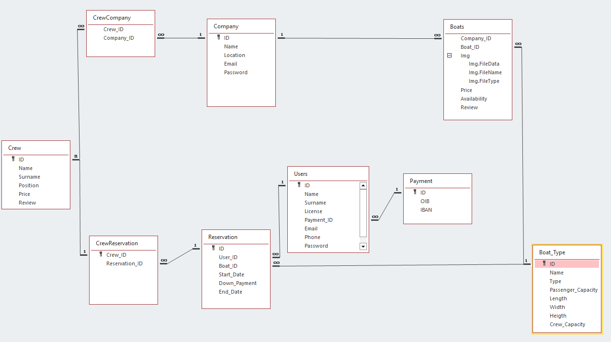

# SmoothSailing

## Devs

Ante Šolić

Antonio Krželj

## List of Contents 📖

- [Introduction](#introduction)
- [Features](#features)
  - [Admin Features](#admin-features)
  - [Company Features](#company-features)
  - [User Features](#user-features)
- [Database](#database)
- [Technologies](#technologies)

## Introduction

Our java based project will allow charter companies to connect with users all around the world. It will improve the booking experience for users making it easier then ever to book their dream charter.

## Features

The features our aplication has are:

### Admin Features:

1. **User Management:**

   - Create, modify, and disable user accounts.
   - Reset user passwords and unlock accounts.

2. **Company Management:**

   - Create, modify, and disable company accounts.
   - Reset company passwords and unlock accounts.

### Company Features:

1. **Crew Management**
2. **Boat Management**
3. **Reservation Management**

### User Features:

1. **Booking a charter:**

   - Filtering by date, boat capacity, boat avilability
   - Reserve for one or many passangers
   - cancel the reservation

## Database

## Technologies

  

  
    
   
  
  
  
  
  
  
  

